

  
  <h1>InstaFoodies: Social Media Platform for Food Enthusiasts</h1>
  
Welcome to InstaFoodies, where culinary creativity meets social networking!

---

## 🍔 Introducing InstaFoodies

Discover and share mouthwatering recipes from around the world. Join a community of food enthusiasts, upload your culinary creations, and connect with fellow foodies.

This repository serves as the main introduction to the InstaFoodies project.

For detailed code and documentation, please refer to the individual repositories:

- [App Repository](https://github.com/orelz890/InstaFoodies): User interface of the InstaFoodies app.
- [Server Repository](https://github.com/orelz890/InstaFoodies_server): Backend server of the InstaFoodies app.

---

## 📋 System Overview

The recipe-sharing application is a vibrant social hub where users weave a culinary tapestry, sharing and unearthing posts both with and without recipes. A canvas for creativity, it empowers users to craft and exchange gastronomic gems, fostering connections and friendships along the way.

Beyond personal joy, it offers a realm of commerce where businesses can curate content, potentially monetizing their culinary expertise. With a feature-rich toolkit, users gather and cherish recipes, translating digital inspiration into tangible delights. In a world where notifications echo like culinary whispers, this platform cultivates a journey of flavors, from novice to connoisseur.

It also has a user-friendly interface that allows for easy navigation and interaction.

---

## Human Interface Design

Our UI is a canvas of user-centric design, harmoniously merging aesthetics and functionality to craft an unparalleled experience.

Key screens include:

## Table of Contents

| Login | Register | Feed |
| :---: | :---: | :---: |
| 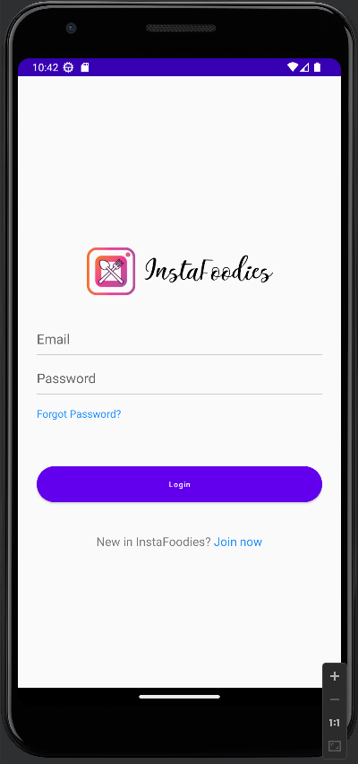 |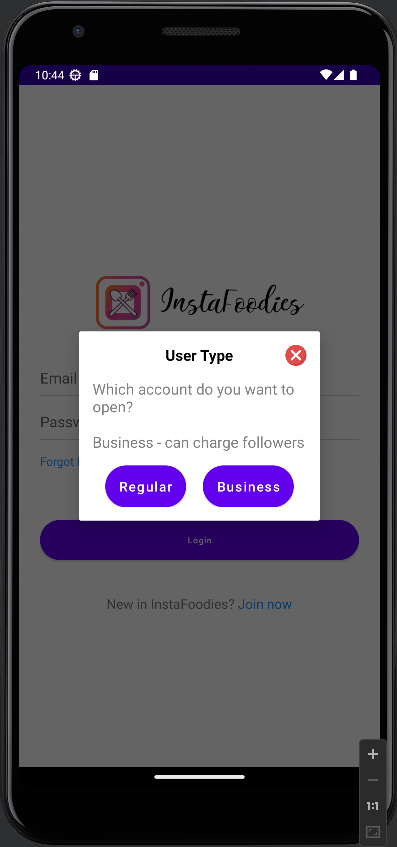  | 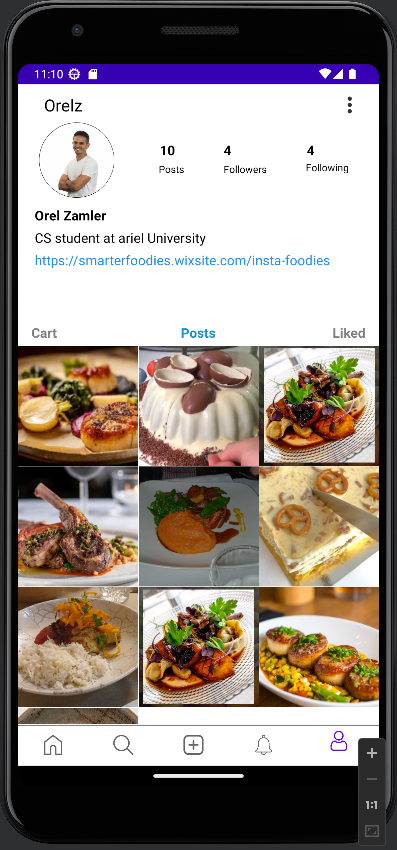 |

| Post | Comments | Scraping |
| :---: | :---: | :---: |
|  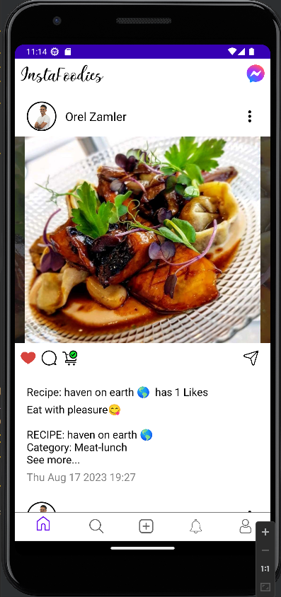  | 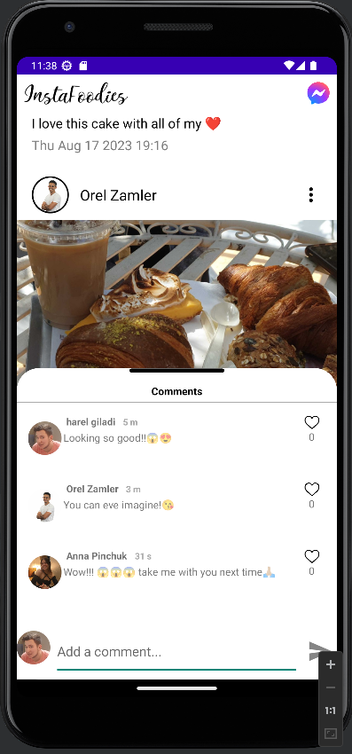 | 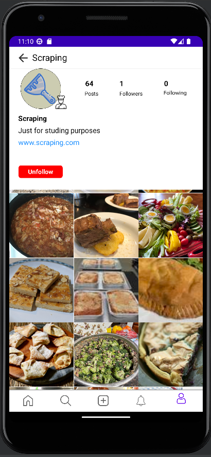 |

| Networking | Chat Requests | Chat |
| :---: | :---: | :---: |
|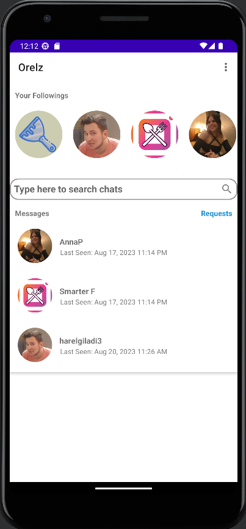| 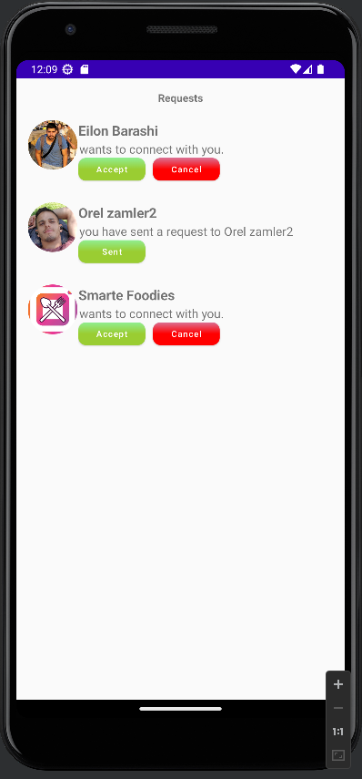 | 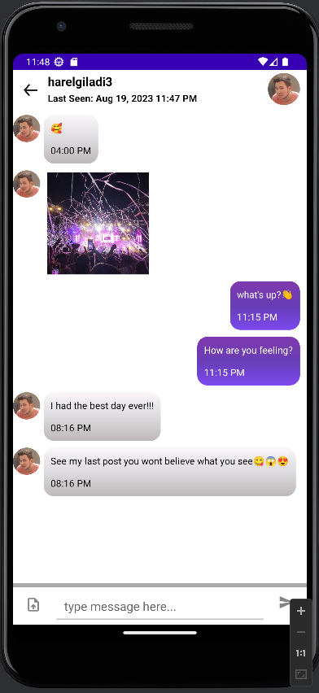 |

| Notifications | Search | Payment |
| :---: | :---: | :---: |
| 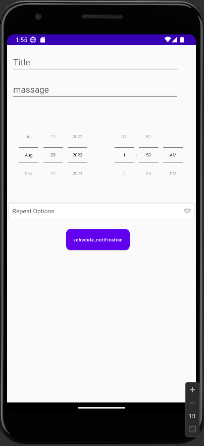 | 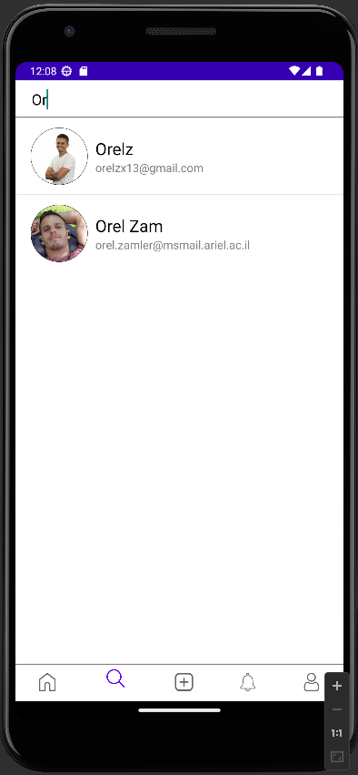 | 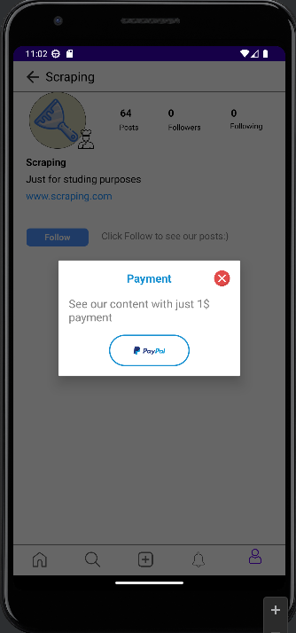 |

## 🏗️ System Architecture

| Start Nginx Load Balancer |
| :---: |
| 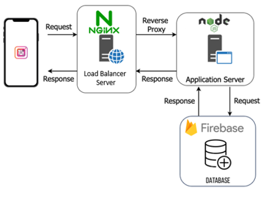 |

---

### Architectural Design

The application developed using the Model-View-ViewModel (MVVM) architectural pattern, which allows for the separation of concerns and easy maintenance of the codebase.

- **Model:** Includes both the communication logic for interacting with the server and the logic for handling data from the server.
- **View:** Android UI, layouts, and user interface elements.
- **ViewModel:** Handles the preparation of data from the Model for the UI and contains UI-related logic.

---

###  Project Management Approach

We embraced Scrum, an agile project management framework, to efficiently manage our project's development. Our daily standup meetings promoted team synchronization, progress sharing, and issue resolution. Guided by a dedicated Scrum Master, we ensured adherence to Scrum principles, rapid obstacle removal, and a culture of continuous improvement.

---

## 🌟 Features

- 📸 Upload food photos with detailed recipe descriptions.
- 👥 Follow users and curate your personalized recipe feed.
- 🗓️ Plan your weekly recipes and export your cart as a WhatsApp message.
- 🔔 Receive real-time notifications for likes, comments, and follows.
- 💬 Chat with friends and fellow food lovers.
- 🔍 Search for users and recipes with ease.
- 🔍 Use content recognition to ensure the quality of shared recipes.
- 🔗 Seamlessly integrate scraped recipes from external websites.

---

## 📜 License

This project is licensed under the [Creative Commons Attribution-NonCommercial 4.0 International License (CC BY-NC 4.0)](https://creativecommons.org/licenses/by-nc/4.0/). This means that you are free to share, adapt, and build upon the material, as long as you provide appropriate attribution, do not use the material for commercial purposes, and do not impose additional legal restrictions.

Please note that this license is designed to prevent commercial usage of the code. If you have any questions about how you can use or adapt this code within the terms of the license, feel free to contact us via email smarterfoodies@gmail.com 📮.

## 📬 Contact

If you have any questions, suggestions, or feedback, please don't hesitate to contact us:

smarterfoodies@gmail.com 📮.
